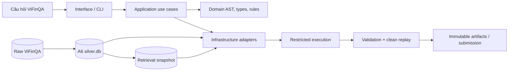

# Text2Pandas

Text2Pandas chuyển câu hỏi tài chính tiếng Việt thành truy vấn Pandas có bằng
chứng trên báo cáo tài chính doanh nghiệp niêm yết. Repository bao gồm pipeline
dữ liệu A6, retrieval, semantic parsing, typed execution, validation, clean
replay và đóng gói submission.

> **Trạng thái tài liệu:** 2026-08-31. Nhánh `main` là bản tích hợp mới nhất.
> Canonical V2 là đường chạy mặc định; Semantic V3/V4 và Grounded V5 chưa được
> tự động promote. Replay/coverage không được hiểu là Answer Accuracy.

## Mục lục

- [1. Tổng quan](#1-tổng-quan)
- [2. Yêu cầu hệ thống](#2-yêu-cầu-hệ-thống)
- [3. Cài đặt từ fresh clone](#3-cài-đặt-từ-fresh-clone)
- [4. Cấu hình](#4-cấu-hình)
- [5. Dữ liệu và checkpoint](#5-dữ-liệu-và-checkpoint)
- [6. Xác minh môi trường và active lineage](#6-xác-minh-môi-trường-và-active-lineage)
- [7. Chạy sản phẩm](#7-chạy-sản-phẩm)
- [8. Tái hiện kết quả](#8-tái-hiện-kết-quả)
- [9. Đầu ra và submission contract](#9-đầu-ra-và-submission-contract)
- [10. Kiến trúc hệ thống](#10-kiến-trúc-hệ-thống)
- [11. Cấu trúc dự án](#11-cấu-trúc-dự-án)
- [12. Kiểm thử và acceptance gates](#12-kiểm-thử-và-acceptance-gates)
- [13. Kết quả đã ghi nhận](#13-kết-quả-đã-ghi-nhận)
- [14. Xử lý lỗi thường gặp](#14-xử-lý-lỗi-thường-gặp)
- [15. Giới hạn hiện tại](#15-giới-hạn-hiện-tại)
- [16. Đóng góp, bảo mật và giấy phép](#16-đóng-góp-bảo-mật-và-giấy-phép)

## 1. Tổng quan

### Chức năng chính

- Chuẩn hóa báo cáo tài chính ViFinQA thành A6 `silver.db` bất biến.
- Xây retrieval snapshot gắn với đúng A6 build.
- Chuyển câu hỏi tiếng Việt thành computation có kiểu và Pandas query.
- Thực thi query trong sandbox giới hạn, sinh answer và evidence.
- Kiểm tra `answer == eval(pandas_query)` bằng clean replay.
- Lưu run manifest, provenance và package submission có thể kiểm toán.

### Các mức tái hiện

| Mức | Có thể làm gì | Dữ liệu lớn cần thiết |
|---|---|---|
| Source/offline | Cài package, kiểm CLI, lint, typecheck và offline tests | Không |
| Runtime | Chạy smoke/full Canonical và Semantic shadow | Raw + A6 + retrieval |
| Release | Chạy hai lần, kiểm determinism, validation, replay và package | Runtime data + exact baseline nếu build Rule 3 |

Fresh clone không chứa database nhiều GB, generated run hoặc submission ZIP.
Raw ViFinQA có nguồn tải công khai và được pin revision. Certified A6/retrieval
bundle hiện chưa có URL phát hành công khai trong repository; có thể nhận đúng
bundle từ maintainer hoặc rebuild từ raw theo hướng dẫn bên dưới.

## 2. Yêu cầu hệ thống

| Thành phần | Yêu cầu |
|---|---|
| Python | CPython `>=3.11`; khuyến nghị `3.11.x` |
| Hệ điều hành | macOS hoặc Linux; Windows nên dùng WSL2 |
| Công cụ | Git, GNU Make, POSIX shell, `unzip`, SQLite có FTS5 |
| RAM | Chưa có hard gate được chứng nhận; nên dùng 16 GB trở lên khi build dữ liệu |
| Dung lượng | Khoảng 11 GB cho active runtime; tối thiểu 40 GB trống để rebuild A6 hai lần |
| Network | Chỉ dùng khi cài dependency hoặc tải raw data; production execution không gọi mạng |

Các dependency quan trọng đã khóa bằng hash trong `requirements.lock`:

| Package | Phiên bản |
|---|---:|
| pandas | `2.3.3` |
| pyarrow | `25.0.0` |
| lxml | `6.1.1` |
| PyYAML | `6.0.3` |
| pytest | `9.1.1` |
| Ruff | `0.16.2` |
| mypy | `2.3.0` |

Kiểm tra Python và SQLite FTS5 trước khi cài:

```bash
python3.11 --version
python3.11 - <<'PY'
import sqlite3

enabled = sqlite3.connect(":memory:").execute(
    "select sqlite_compileoption_used('ENABLE_FTS5')"
).fetchone()[0]
print("sqlite", sqlite3.sqlite_version, "fts5", bool(enabled))
raise SystemExit(0 if enabled else 1)
PY
```

## 3. Cài đặt từ fresh clone

### 3.1. Clone source mới nhất

```bash
git clone https://github.com/dinhvanan307/text2pandas_r2ai.git
cd text2pandas_r2ai
git switch main
git status --short --branch
git rev-parse HEAD
```

Lưu commit từ `git rev-parse HEAD` cùng mọi report để kết quả có thể truy vết.
Khi tái hiện một checkpoint lịch sử, phải checkout đúng `source_commit` trong
manifest thay vì dùng source mới nhất.

### 3.2. Tạo môi trường Python hash-locked

```bash
python3.11 -m venv .venv
source .venv/bin/activate
python -m pip install --require-hashes -r requirements.lock
python -m pip install --no-deps -e .
make dp-env-check
```

Kết quả đạt yêu cầu khi `make dp-env-check` xác nhận đúng Python, dependency,
SQLite, Git commit và config hash. Không dùng `pip install -e ".[dev]"` cho
acceptance/release vì đường cài đó không frozen bằng `requirements.lock`.

### 3.3. Kiểm tra source-only

```bash
text2pandas --help
make lint
make typecheck
make test-offline
```

Các lệnh trên không cần database active. Nếu chỉ phát triển source hoặc đọc kiến
trúc, có thể dừng tại đây.

## 4. Cấu hình

### 4.1. Khai báo data, artifact và scratch root

Dùng đường dẫn tuyệt đối và volume còn đủ dung lượng:

```bash
export T2P_DATA_ROOT=/absolute/path/to/text2pandas-data
export T2P_ARTIFACT_ROOT="$PWD/artifacts"
export TEXT2PANDAS_SCRATCH=/absolute/path/to/fast-local-scratch

mkdir -p "$T2P_DATA_ROOT" "$T2P_ARTIFACT_ROOT" "$TEXT2PANDAS_SCRATCH"
make paths-check
```

| Biến | Nội dung | Có được ghi đè artifact cũ? |
|---|---|---|
| `T2P_DATA_ROOT` | Raw, processed A6 và retrieval snapshot | Không |
| `T2P_ARTIFACT_ROOT` | Run, report và package được sinh | Không |
| `TEXT2PANDAS_SCRATCH` | File làm việc tạm thời | Có, nếu không được manifest tham chiếu |

Mỗi run phải dùng `run-id` mới. Không dùng thư mục tên `latest`, modification
time hoặc directory order để chọn dữ liệu.

### 4.2. Active identities

Nguồn chọn active lineage duy nhất là
[`configs/datasets/active_snapshot.yaml`](configs/datasets/active_snapshot.yaml):

| Layer | Identity | Đường dẫn dưới `T2P_DATA_ROOT` |
|---|---|---|
| Raw ViFinQA | `ca033190f2e9e99f` | `raw/btc` |
| A6 | `c6887fb633374fad` | `processed/a6/c6887fb633374fad` |
| Retrieval | `872ccb0dda9a2bb6` | `indexes/retrieval/c6887fb633374fad/872ccb0dda9a2bb6` |

Không sửa các ID này để ép một artifact khác thành active. Artifact mới phải có
identity, manifest, checksum và acceptance gate riêng.

## 5. Dữ liệu và checkpoint

### 5.1. Tải raw ViFinQA đúng revision

| Thuộc tính | Giá trị |
|---|---|
| Dataset | [`AIGuruTinix/ViFinQA`](https://huggingface.co/datasets/AIGuruTinix/ViFinQA) |
| Revision | `0450088ab22ec946f04f097586967ca405955b3b` |
| Snapshot ID | `ca033190f2e9e99f` |
| Expected counts | 1.973 báo cáo, 1.012 câu hỏi, 100 ticker |

Dùng virtual environment riêng cho downloader để không thay đổi runtime lock:

```bash
python3.11 -m venv .venv-data
.venv-data/bin/python -m pip install -r tools/data_acquisition/requirements.txt

export VIFINQA_REVISION=0450088ab22ec946f04f097586967ca405955b3b
.venv-data/bin/python - <<'PY'
import os
from pathlib import Path

from huggingface_hub import snapshot_download

destination = Path(os.environ["T2P_DATA_ROOT"]) / "raw" / "btc"
snapshot_download(
    repo_id="AIGuruTinix/ViFinQA",
    repo_type="dataset",
    revision=os.environ["VIFINQA_REVISION"],
    local_dir=destination,
)
print(destination)
PY

.venv-data/bin/python tools/data_acquisition/download_vifinqa.py \
  --dest "$T2P_DATA_ROOT/raw/btc" \
  --verify-only \
  --skip-github

cp data/raw/btc/manifest.json "$T2P_DATA_ROOT/raw/btc/manifest.json"
```

`--verify-only` chuẩn hóa metadata cần thiết và kiểm 13 điều kiện về count/cấu
trúc. Không tải revision HEAD mới hơn cho active lineage nếu chưa tạo snapshot
identity mới.

### 5.2. A6 và retrieval checkpoint được chứng nhận

| Layer | File | Bytes | SHA-256 |
|---|---|---:|---|
| A6 | `processed/a6/c6887fb633374fad/silver.db` | `4,140,924,928` | `fa6c46d6d46b4735f6a23fe1f2b8e2be16c206b712f47b8f22a5f0647f5dc3c8` |
| Retrieval | `indexes/retrieval/c6887fb633374fad/872ccb0dda9a2bb6/retrieval.db` | `4,239,663,104` | `72d307f8a2bb542a40f97e112456d537b90823e7b57a20eaef04a94545ab6daf` |

#### Cách A — dùng certified bundle

Nhận hai database cùng metadata/manifest từ maintainer và copy vào đúng đường
dẫn trong bảng. Repository không chứa database lớn và hiện chưa công bố URL tải
bundle. Không sử dụng bundle nếu không đối chiếu được checksum.

```bash
python - <<'PY'
import hashlib
import os
from pathlib import Path

root = Path(os.environ["T2P_DATA_ROOT"])
expected = {
    root / "processed/a6/c6887fb633374fad/silver.db":
        "fa6c46d6d46b4735f6a23fe1f2b8e2be16c206b712f47b8f22a5f0647f5dc3c8",
    root / "indexes/retrieval/c6887fb633374fad/872ccb0dda9a2bb6/retrieval.db":
        "72d307f8a2bb542a40f97e112456d537b90823e7b57a20eaef04a94545ab6daf",
}

for path, wanted in expected.items():
    digest = hashlib.sha256()
    with path.open("rb") as handle:
        for block in iter(lambda: handle.read(8 << 20), b""):
            digest.update(block)
    actual = digest.hexdigest()
    print(path, actual, "PASS" if actual == wanted else "FAIL")
    if actual != wanted:
        raise SystemExit(1)
PY
```

#### Cách B — rebuild từ raw

Certified A6 manifest được tạo từ source commit
`7837635188639c7fb68b167b2b80ddfbc3935d30`. Vì build identity chứa source
fingerprint, exact rebuild phải chạy commit này trong clean worktree. Source
commit khác tạo một candidate mới, dù dùng cùng raw/config.

Từ repository root đã clone:

```bash
export T2P_MAIN_ROOT="$PWD"
export A6_SOURCE_COMMIT=7837635188639c7fb68b167b2b80ddfbc3935d30
export A6_WORKTREE="$(dirname "$PWD")/text2pandas-a6-7837635"

git worktree add "$A6_WORKTREE" "$A6_SOURCE_COMMIT"
cd "$A6_WORKTREE"

python3.11 -m venv .venv
source .venv/bin/activate
python -m pip install --require-hashes -r requirements.lock
python -m pip install --no-deps -e .
make dp-env-check
```

Giữ nguyên `T2P_DATA_ROOT` đã chứa raw data. Dùng hai output mới để kiểm
determinism:

```bash
export T2P_ARTIFACT_ROOT=/absolute/path/to/text2pandas-a6-artifacts
export A6_ID=c6887fb633374fad
export RETRIEVAL_ID=872ccb0dda9a2bb6
export BUILD_A="$T2P_ARTIFACT_ROOT/runs/a6/reproduce-a"
export BUILD_B="$T2P_ARTIFACT_ROOT/runs/a6/reproduce-b"

mkdir -p "$T2P_ARTIFACT_ROOT"

make dp-build FINALIZE=1 \
  CONFIG=configs/vifinqa_silver_v1.yaml \
  INPUT="$T2P_DATA_ROOT/raw/btc/financial_statements" \
  OUTPUT="$BUILD_A"

make dp-build FINALIZE=1 \
  CONFIG=configs/vifinqa_silver_v1.yaml \
  INPUT="$T2P_DATA_ROOT/raw/btc/financial_statements" \
  OUTPUT="$BUILD_B"

python tools/rebuild_check.py \
  --build-a "$BUILD_A" \
  --build-b "$BUILD_B" \
  --mode final \
  --db-sha256 \
  --report "$T2P_ARTIFACT_ROOT/reports/a6-reproduce-c0-final.json"
```

Hai build phải có cùng `build_id`. Exact certified rebuild phải cho
`c6887fb633374fad`; nếu khác, dừng và giữ artifact như candidate mới.

Tạo A6 release local và retrieval snapshot:

```bash
make dp-release \
  DB="$BUILD_A/silver/$A6_ID/silver.sqlite" \
  BRONZE="$BUILD_A/bronze/catalog_v2.sqlite" \
  QUALITY="$BUILD_A/silver/$A6_ID/quality_report.json" \
  OUTPUT="$T2P_DATA_ROOT/processed/a6/$A6_ID" \
  REPORT_DIR="$T2P_ARTIFACT_ROOT/reports/a6-reproduce-release"

python - <<'PY'
import os
from pathlib import Path

from text2pandas.infrastructure.retrieval.snapshot import build_retrieval_snapshot

root = Path(os.environ["T2P_DATA_ROOT"])
a6_id = os.environ["A6_ID"]
index_id = os.environ["RETRIEVAL_ID"]
result = build_retrieval_snapshot(
    root / "processed" / "a6" / a6_id / "silver.db",
    root / "indexes" / "retrieval" / a6_id / index_id,
    expected_build_id=a6_id,
)
print(result)
PY

cd "$T2P_MAIN_ROOT"
source .venv/bin/activate
export T2P_ARTIFACT_ROOT="$T2P_MAIN_ROOT/artifacts"
```

Không truyền `GATE_REPORT` nên `dp-release` ghi đúng đây là local release. Muốn
gắn nhãn certified phải chạy đủ acceptance gates; không sửa nhãn trong manifest
bằng tay. Snapshot builder từ chối output đã tồn tại: hãy dùng data root mới thay
vì xóa/ghi đè checkpoint bất biến.

### 5.3. Model checkpoint

Đường Canonical và Semantic V3 deterministic không cần tải LLM checkpoint.

- `configs/retrieval/models/linear_reranker_v1.json` là checkpoint nhỏ đã tracked,
  nhưng chưa được promote làm default.
- `configs/models.yaml` chưa khai production embedding/reranker/coder model.
- Grounded V5 có optional Ollama adapter nhưng input/model digest chưa được phát
  hành thành public reproducible bundle; vì vậy không thuộc fresh-clone runbook.
- Release deterministic không được phụ thuộc closed model hoặc remote inference.

## 6. Xác minh môi trường và active lineage

Sau khi materialize raw, A6 và retrieval, chạy:

```bash
make dp-env-check
make paths-check
make snapshots-verify
python tools/data_acquisition/download_vifinqa.py \
  --dest "$T2P_DATA_ROOT/raw/btc" \
  --verify-only \
  --skip-github
```

Tiêu chí PASS:

- raw snapshot là `ca033190f2e9e99f` và đủ expected counts;
- A6 build là `c6887fb633374fad`;
- retrieval index là `872ccb0dda9a2bb6` và bind đúng A6;
- schema/count/index contract hợp lệ;
- với certified bundle, SHA-256 khớp bảng tại phần 5.2.

`make snapshots-verify` cố ý không hash database nhiều GB, do đó không thay thế
bước SHA-256 khi kiểm certified payload.

## 7. Chạy sản phẩm

### 7.1. Smoke test 10 câu

```bash
text2pandas run \
  --run-id reproduce-smoke-001 \
  --offset 0 \
  --limit 10 \
  --no-package
```

Partial run bắt buộc có `--no-package`. Output nằm tại:

```text
$T2P_ARTIFACT_ROOT/runs/answer/reproduce-smoke-001/
├── manifest.json
└── records.jsonl
```

Nếu đã dùng `reproduce-smoke-001`, hãy đổi sang một `run-id` mới.

### 7.2. Full Canonical baseline

```bash
export RUN_A=reproduce-canonical-a-001
text2pandas run --run-id "$RUN_A" --no-package
```

Run phải xử lý đủ 1.012 câu. Canonical hiện còn abstention nên lệnh không có
`--no-package` sẽ fail closed ở complete-profile packaging; đây là hành vi đúng,
không phải lỗi cài đặt.

### 7.3. Semantic V3 shadow

```bash
text2pandas shadow-v3 \
  --run-id reproduce-semantic-v3-001 \
  --operand-k 20 \
  --legacy-run-id "$RUN_A" \
  --canonical-table-priors
```

Shadow run không thay output Canonical. Chỉ package/promote khi policy và gold
gate tương ứng PASS.

Xem toàn bộ subcommand và tham số hiện hành bằng:

```bash
text2pandas --help
text2pandas run --help
text2pandas shadow-v3 --help
```

## 8. Tái hiện kết quả

### 8.1. Kiểm determinism của Canonical

Chạy hai lần độc lập với hai run ID mới:

```bash
export RUN_A=reproduce-canonical-a-001
export RUN_B=reproduce-canonical-b-001

text2pandas run --run-id "$RUN_A" --no-package
text2pandas run --run-id "$RUN_B" --no-package

cmp \
  "$T2P_ARTIFACT_ROOT/runs/answer/$RUN_A/records.jsonl" \
  "$T2P_ARTIFACT_ROOT/runs/answer/$RUN_B/records.jsonl"
```

PASS khi cả hai run xử lý cùng 1.012 câu và `cmp` trả exit code `0`. Hai manifest
có thể khác vì chứa `run-id` và thời gian chạy.

`make verify-active-candidate RUN_A=... RUN_B=...` chỉ dùng khi cả hai run đã có
validated ZIP. Không dùng gate này để biến baseline có abstention thành complete
candidate.

### 8.2. Rebuild Rule 3 competition candidate

Rule 3 candidate được sửa từ exact official baseline 3842, không phải chỉ từ
Canonical baseline. File baseline nằm ngoài Git và phải có SHA-256:

```text
2a3457ee2af0b43ef849cc1a5e0d9c46c78cc94e34e560369796a02defa93d76
```

Nếu không có exact ZIP, trạng thái là `BLOCKED`; không dùng một ZIP gần giống.

```bash
export BASELINE_3842=/absolute/path/to/submission-3842.zip
export RULE3_RUN=rule3-3842-reproduce-001

PYTHONPATH=src python tools/build_rule3_compliance_candidate.py \
  --run-id "$RULE3_RUN" \
  --baseline "$BASELINE_3842" \
  --a6-database "$T2P_DATA_ROOT/processed/a6/c6887fb633374fad/silver.db" \
  --corpus "$T2P_DATA_ROOT/raw/btc/financial_statements" \
  --questions "$T2P_DATA_ROOT/raw/btc/questions/questions.jsonl" \
  --run-root "$T2P_ARTIFACT_ROOT/runs/rule3-compliance"

unzip -t \
  "$T2P_ARTIFACT_ROOT/runs/rule3-compliance/${RULE3_RUN}.zip"
```

Expected checkpoint: 1.012 record, 798 query thực thi/khớp, 214 unresolved,
0 competition validation error và hai ZIP byte-identical. Complete profile vẫn
`FAIL`; Answer Accuracy của candidate mới là `NOT_MEASURED`.

## 9. Đầu ra và submission contract

### Run artifact

```text
$T2P_ARTIFACT_ROOT/
└── runs/
    ├── answer/<run-id>/
    │   ├── manifest.json
    │   └── records.jsonl
    └── rule3-compliance/
        ├── <run-id>/manifest.json
        └── <run-id>.zip
```

Manifest phải ghi source commit, config/input identity, run ID, counts, trạng
thái gate và checksum của output quan trọng.

### Submission ZIP

Một package hợp lệ có đúng một JSON ở archive root và mọi CSV được tham chiếu
nằm dưới `data/`:

```text
submission.zip
├── submission.json
└── data/
    ├── table_001.csv
    └── table_002.csv
```

Mỗi record gồm `id`, `question`, `answer`, `relevant_docs`, `relevant_tables`,
`evidence` và `pandas_query`. Validator từ chối path không an toàn, locator sai,
CSV orphan, query không an toàn, duplicate evidence, câu hỏi lệch source hoặc
answer không khớp clean Pandas replay.

## 10. Kiến trúc hệ thống

Text2Pandas dùng layered architecture cho runtime typed mới và strangler
architecture để thay dần Canonical V2.



| Layer | Package | Trách nhiệm |
|---|---|---|
| Domain | `src/text2pandas/domain/` | AST, semantic types, metrics, units và pure business rules |
| Application | `src/text2pandas/application/` | Parsing, planning, retrieval contracts, binding, execution, verification, use cases |
| Infrastructure | `src/text2pandas/infrastructure/` | Filesystem, SQLite, A6/retrieval, Pandas replay, sandbox, optional model adapter |
| Interface | `src/text2pandas/interface/` | CLI composition root và optional API boundary |
| Migration | `src/text2pandas/pipelines/` | Canonical V2, A6 và retrieval code trong giai đoạn strangler migration |

Luồng Canonical mặc định:

```text
text2pandas run
  -> interface/cli
  -> application/usecases/canonical_run
  -> pipelines/retrieval + pipelines/answering
  -> application/usecases/submission
  -> infrastructure/sandbox
  -> records.jsonl / validated package
```

Luồng Semantic V3 shadow:

```text
Vietnamese annotation
  -> SemanticParser
  -> immutable QuestionAST
  -> execution plan
  -> operand-aware retrieval
  -> JointBinder
  -> TypedExecutor
  -> restricted Pandas compiler
  -> clean replay + evidence
```

Repository chưa phải Clean Architecture hoàn tất. Một số Canonical/use case
chuyển tiếp còn import trực tiếp `infrastructure` hoặc `pipelines`;
`application/ports/` chưa phải inversion boundary đầy đủ. Code mới không được
import compatibility namespaces `data_pipeline`, `retrieval` hoặc
`text2pandas.answer_pipeline`.

Các quyết định nền tảng: [ADR-0008](docs/adr/0008-semantic-query-engine-v3.md),
[ADR-0015](docs/adr/0015-semantic-v3-artifact-level-strangler.md) và
[ADR-0016](docs/adr/0016-submission-validation-profiles.md).

## 11. Cấu trúc dự án

```text
text2pandas_r2ai/
├── src/
│   ├── text2pandas/
│   │   ├── domain/              # AST, types, metric/unit/value rules
│   │   ├── application/         # use cases, parsing, planning, binding, execution
│   │   ├── infrastructure/      # SQLite, retrieval, sandbox, Pandas/model adapters
│   │   ├── interface/           # CLI và optional API
│   │   ├── pipelines/           # A6, Canonical V2, retrieval migration code
│   │   └── answer_pipeline/     # compatibility re-export
│   ├── data_pipeline/           # compatibility namespace
│   └── retrieval/               # compatibility namespace
├── configs/
│   ├── datasets/                # active snapshot identities
│   ├── semantic/                # ontology, parser/search/promotion policy
│   ├── retrieval/               # retrieval config và tracked model bytes
│   ├── evaluation/              # gold/review/release protocols
│   ├── execution/               # execution policy
│   └── testing/                 # governed skip allowlist
├── data/
│   ├── raw/                     # immutable source corpus
│   ├── processed/               # A6 builds theo build_id
│   ├── indexes/                 # retrieval snapshots theo index_id
│   └── curated/                 # governed evaluation/gold inputs
├── artifacts/                   # generated runs/reports/ZIPs; Git-ignored
├── provenance/                  # tracked identities, checksums và audit seals
├── tools/                       # operator/evaluation scripts; không phải runtime imports
├── tests/
│   ├── unit/
│   ├── integration/
│   ├── regression/
│   ├── semantic/
│   └── fixtures/
├── docs/
│   ├── adr/                     # architecture decision records
│   ├── competition/             # source contract và license notes
│   └── reports/                 # dated evidence
├── Makefile                     # reproducible commands và gates
├── pyproject.toml               # package/CLI/tool configuration
└── requirements.lock            # hash-locked environment
```

| Muốn tìm hiểu | Điểm bắt đầu |
|---|---|
| CLI và subcommands | [`src/text2pandas/interface/cli/main.py`](src/text2pandas/interface/cli/main.py) |
| Canonical runtime | [`src/text2pandas/application/usecases/canonical_run.py`](src/text2pandas/application/usecases/canonical_run.py) |
| Semantic V3 E2E | [`src/text2pandas/application/usecases/semantic_v3.py`](src/text2pandas/application/usecases/semantic_v3.py) |
| AST/type system | [`src/text2pandas/domain/semantic/`](src/text2pandas/domain/semantic/) |
| Typed/Pandas execution | [`src/text2pandas/application/execution/`](src/text2pandas/application/execution/) |
| Validation/package | [`src/text2pandas/application/usecases/submission.py`](src/text2pandas/application/usecases/submission.py) |
| Data lifecycle | [`data/README.md`](data/README.md) |
| Migration state | [`docs/SEMANTIC_V3_MIGRATION_STATUS.md`](docs/SEMANTIC_V3_MIGRATION_STATUS.md) |

## 12. Kiểm thử và acceptance gates

| Gate | Lệnh | Phạm vi |
|---|---|---|
| Markdown links | `make docs-check` | Tất cả Markdown tracked |
| Static checks | `make lint` | Ruff |
| Typed architecture | `make typecheck` | Domain/application/infrastructure/interface |
| Offline suite | `make test-offline` | Không cần materialized database |
| Integration suite | `make test-integration` | Cần active raw/A6/retrieval |
| Snapshot lineage | `make snapshots-verify` | Active raw → A6 → retrieval |
| Full acceptance report | `make dp-test REPORT_DIR=<new-dir>` | JSON/text/JUnit evidence |
| Route coverage | `make semantic-coverage` | Coverage, không phải accuracy |

Gate tối thiểu trước release:

```bash
make lint
make typecheck
make test-offline
make test-integration
make snapshots-verify
git diff --check
```

Historical tests cần authentic pre-refactor artifacts và chỉ chạy bằng
`make test-historical`. Không tạo file giả hoặc nới skip để làm gate xanh.

### Checklist tái hiện

- [ ] Ghi lại `git rev-parse HEAD`.
- [ ] Python/dependency/SQLite khớp `dp-env-check`.
- [ ] Raw revision, A6 ID và retrieval ID khớp active config.
- [ ] Certified database SHA-256 khớp manifest.
- [ ] Mỗi build/run dùng output directory và run ID mới.
- [ ] Hai Canonical `records.jsonl` byte-identical.
- [ ] Validation và clean replay đều PASS cho mọi query đã phát.
- [ ] Metrics chưa có gold được ghi `NOT_MEASURED`.
- [ ] Submission receipt được bind với exact ZIP SHA-256.

## 13. Kết quả đã ghi nhận

| Artifact | Trạng thái đã đo | Bằng chứng |
|---|---|---|
| Official submission `3842` | 1.012 record; 798 executable; 214 unresolved; Answer/Execution Accuracy `0.3893` | [`provenance/submissions/submission_3842.json`](provenance/submissions/submission_3842.json) |
| Rule 3 candidate | 798/798 replay match; 0 validation error; deterministic; không tự động upload | [Rule 3 report](docs/reports/RULE3_COMPLIANCE_REPAIR_2026-08-31.md) |
| Semantic V3 Wave 6 S6 | 492 `OK`; 520 `ABSTAIN`; 492/492 replay match; Answer Accuracy `NOT_MEASURED`; promotion `BLOCKED` | [Wave 6 S6 report](docs/reports/SEMANTIC_PARSER_WAVE6_COMPOSITION_S6_E2E_REPORT_2026-08-31.md) |

Candidate recall, ranking, route coverage, executable coverage, replay và
official accuracy là các đại lượng khác nhau; không dùng một đại lượng thay cho
đại lượng khác.

## 14. Xử lý lỗi thường gặp

| Triệu chứng | Nguyên nhân thường gặp | Cách xử lý |
|---|---|---|
| `ModuleNotFoundError: text2pandas` | Chưa activate venv hoặc chưa cài editable package | `source .venv/bin/activate` rồi `python -m pip install --no-deps -e .` |
| SQLite báo thiếu FTS5 | Python/SQLite build không có FTS5 | Dùng CPython 3.11 có `ENABLE_FTS5`, chạy lại kiểm tra phần 2 |
| `snapshots-verify` báo missing database | Fresh clone chỉ có manifest nhỏ | Nhận certified bundle hoặc rebuild theo phần 5.2 |
| Build ID khác active ID | Source/raw/config fingerprint khác checkpoint | Không sửa active config; giữ artifact như candidate và kiểm lại source commit |
| Output/run đã tồn tại | Run ID và snapshot là bất biến | Chọn run ID/output directory mới |
| Partial run không package được | Complete package yêu cầu đủ 1.012 record | Dùng `--no-package` cho smoke/partial run |
| Full Canonical không tạo ZIP | Canonical còn abstention, complete profile fail closed | Dùng `--no-package`; chỉ package candidate đạt contract |
| Rule 3 tool báo baseline mismatch | ZIP không đúng official baseline 3842 | Kiểm SHA-256; dừng nếu không có exact ZIP |
| Replay PASS nhưng chưa biết accuracy | Replay chỉ chứng minh query khớp packaged answer | Báo `NOT_MEASURED` cho tới khi có independent gold/official receipt |

## 15. Giới hạn hiện tại

- Public URL cho certified A6/retrieval bundle chưa được khai báo.
- Official score chỉ có ý nghĩa với exact submission receipt và ZIP SHA-256.
- Rule 3 candidate còn 214 unresolved; complete profile chưa PASS.
- Semantic Wave 6 S6 còn 520 abstention và chưa có independent answer gold.
- Grounded V5 chưa có public reproducible bundle cho input/model digest.
- Một số Canonical V2 module vẫn là migration debt, chưa theo typed boundary hoàn toàn.
- Không overwrite raw snapshot, immutable database, run artifact hoặc release path.

Nếu thiếu prerequisite, gold hoặc external artifact, ghi `BLOCKED` hoặc
`NOT_MEASURED`; không thay bằng file giả, hard-code answer hay nới validation.

## 16. Đóng góp, bảo mật và giấy phép

- Quy trình đóng góp: [CONTRIBUTING.md](CONTRIBUTING.md)
- Chính sách bảo mật: [SECURITY.md](SECURITY.md)
- Hợp đồng vận hành agent: [AGENTS.md](AGENTS.md)
- Data ownership/lifecycle: [data/README.md](data/README.md)
- Competition source và license notes: [docs/competition/README.md](docs/competition/README.md)
- A6 acceptance evidence: [docs/reports/ACCEPTANCE_TEST_REPORT_2026-08-27.md](docs/reports/ACCEPTANCE_TEST_REPORT_2026-08-27.md)

Corpus báo cáo tài chính được ghi nhận theo CC BY-NC 4.0; trạng thái license của
question annotations cần được kiểm tra trong tài liệu competition trước khi tái
phân phối. Repository hiện không có tệp `LICENSE` cấp root, vì vậy không suy diễn
quyền sử dụng source code ngoài các điều khoản đã được chủ sở hữu công bố.
